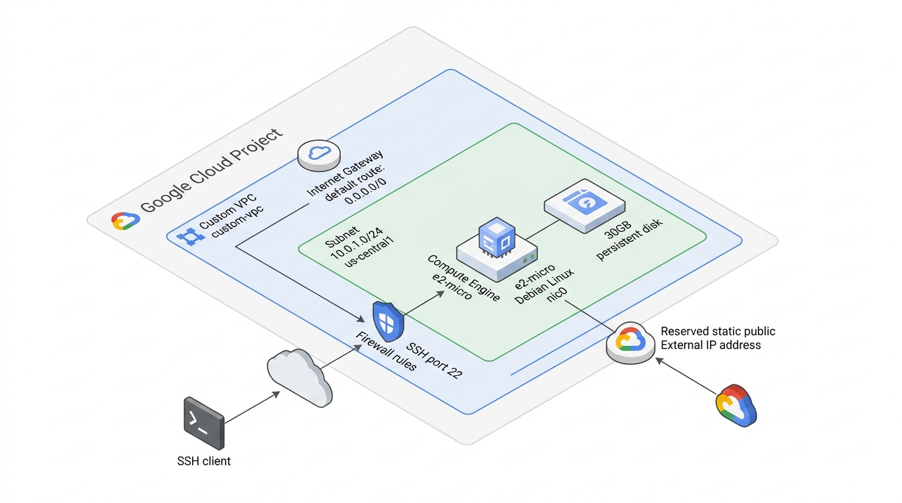

# Infraestructura en Google Cloud Platform con Terraform

Proyecto modular de Infraestructura como Código (IaC) en Terraform para aprovisionar una arquitectura de red personalizada (VPC y Subred) y una instancia de Compute Engine con dirección IP externa estática reservada en Google Cloud Platform.

---

## 🏗️ Arquitectura y Componentes

<p align="center">
  
</p>

### Recursos Aprovisionados
1. **Red (VPC Custom):**
   - Red en modo personalizado (`auto_create_subnetworks = false`).
   - Subred con rango CIDR configurable (`10.0.1.0/24`).
   - Ruta hacia el Internet Gateway predeterminado.
   - Reglas de firewall para tráfico interno, acceso SSH (puerto 22 con etiqueta `ssh-enabled`), acceso HTTP (puerto 80 con etiqueta `http-server`) y acceso VPN WireGuard (puerto 51820 UDP con etiqueta `wireguard-server`).

2. **Cómputo (Compute Engine):**
   - Instancia de máquina virtual basada en `e2-micro` (dentro del Free Tier de GCP).
   - Disco de arranque persistente de 30 GB con Debian.
   - Etiquetas de red: `ssh-enabled`, `http-server` y `wireguard-server`.
   - `OS Login` configurable o inyección de llaves SSH públicas vía metadatos.
   - **IP Externa Estática:** Reserva dedicada mediante `google_compute_address` vinculada a la VM.

---

## 📁 Estructura del Proyecto

```text
Terraform-GCP/
├── main.tf                 # Invocación y orquestación de módulos (vpc y compute)
├── variables.tf            # Definición de variables raíz
├── outputs.tf              # Definición de outputs raíz del despliegue
├── versions.tf             # Versiones requeridas de Terraform y proveedores
├── terraform.tfvars.example# Plantilla de valores de variables
├── .gitignore              # Archivos y estados excluidos del control de versiones
└── modules/
    ├── vpc/                # Módulo de Red
    │   ├── main.tf         # VPC, Subnet, Firewall y Rutas
    │   ├── variables.tf    # Parámetros del módulo VPC
    │   └── outputs.tf      # IDs y nombres exportados de red/subred
    └── compute/            # Módulo de Cómputo
        ├── main.tf         # Instancia VM y Reserva de IP Estática
        ├── variables.tf    # Parámetros del módulo Compute
        └── outputs.tf      # Nombres e IPs asignadas
```

---

## 📋 Requisitos Previos

1. **Terraform CLI**: Versión `>= 1.15.0` ([Instalar Terraform](https://developer.hashicorp.com/terraform/install)).
2. **Google Cloud SDK (`gcloud`)**: ([Instalar gcloud CLI](https://cloud.google.com/sdk/docs/install)).
3. **Proyecto en GCP** con facturación habilitada.
4. **Inicio de sesión y configuración en gcloud CLI:**
   ```bash
   gcloud auth login
   gcloud config set project PROJECT_ID
   ```
5. **APIs habilitadas en GCP:**
   ```bash
   gcloud services enable compute.googleapis.com
   ```
6. **Autenticación local para Terraform (Application Default Credentials) y asignación de cuota y contexto de facturación (Quota Project):**
   ```bash
   gcloud auth application-default login --project=PROJECT_ID
   gcloud auth application-default set-quota-project PROJECT_ID
   ```

---

## 🚀 Guía de Despliegue

### 1. Clonar el repositorio y acceder al directorio
```bash
git clone <URL_DEL_REPOSITORIO>
cd Terraform-GCP
```

### 2. Configurar las variables
Copia la plantilla de variables o edita tu `terraform.tfvars`:
```bash
cp terraform.tfvars.example terraform.tfvars
```

Edita `terraform.tfvars` con tu ID de proyecto y parámetros deseados:
```hcl
project_id               = "tu-project-id"
region                   = "us-central1"
zone                     = "us-central1-a"
network_name             = "custom-vpc"
subnet_name              = "custom-subnet"
subnet_cidr              = "10.0.1.0/24"
allowed_ssh_cidr         = ["0.0.0.0/0"] # Recomendado: Restringir a tu IP pública o rango de IPs
allowed_http_cidr        = ["0.0.0.0/0"]
allowed_wireguard_cidr   = ["0.0.0.0/0"]
instance_name            = "vm-custom-e2-micro"
machine_type             = "e2-micro"
```

### 3. Inicializar Terraform
Descarga los proveedores requeridos (Google Cloud Provider) e inicializa los módulos:
```bash
terraform init
```

### 4. Validar y planificar
Valida la sintaxis del código y genera el plan de ejecución:
```bash
terraform validate
terraform plan -out=tfplan
```

### 5. Aplicar la infraestructura
Aprovisiona los recursos en Google Cloud:
```bash
terraform apply tfplan
```
*(Al usar un archivo de plan previamente generado con `-out`, la aplicación se ejecuta directamente sin solicitar confirmación interactiva).*

---

## 📤 Outputs

Al finalizar el despliegue, Terraform mostrará los siguientes datos:

| Nombre | Descripción |
|---|---|
| `vpc_name` | Nombre de la red VPC creada |
| `subnet_name` | Nombre de la subred creada |
| `vm_instance_name` | Nombre de la instancia Compute Engine |
| `vm_internal_ip` | Dirección IP privada asignada en la subred |
| `vm_external_ip` | Dirección IP pública estática reservada |

Para consultarlos nuevamente en cualquier momento:
```bash
terraform output
```

---

## 🔐 Conexión a la Instancia

Con la clave SSH pública inyectada en los metadatos de la instancia, puedes conectarte directamente a través de la dirección IP pública estática:

**Patrón:**
```bash
ssh [USERNAME]@[IP_ADDRESS]
```

**Ejemplo:**
```bash
ssh camiseta77@35.209.217.119
```

O alternativamente usando la herramienta de línea de comandos de Google Cloud (`gcloud`):

**Patrón:**
```bash
gcloud compute ssh --zone "[ZONE]" "[INSTANCE_NAME]" --ssh-key-file=[SSH_KEY_FILE] --project "[PROJECT_ID]"
```

**Ejemplo:**
```bash
gcloud compute ssh --zone "us-central1-a" "vm-custom-e2-micro" --ssh-key-file=~/.ssh/id_ed25519 --project "gcp-infrastructure-509318"
```

---

## 🧹 Limpieza y Destrucción

Para evitar cargos continuos en GCP, destruye los recursos creados cuando ya no los necesites:

```bash
terraform destroy
```
Confirma la acción escribiendo `yes`.
